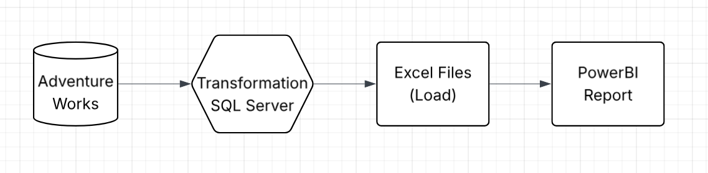
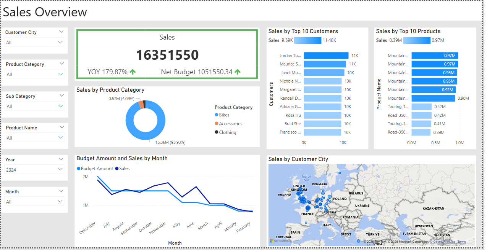
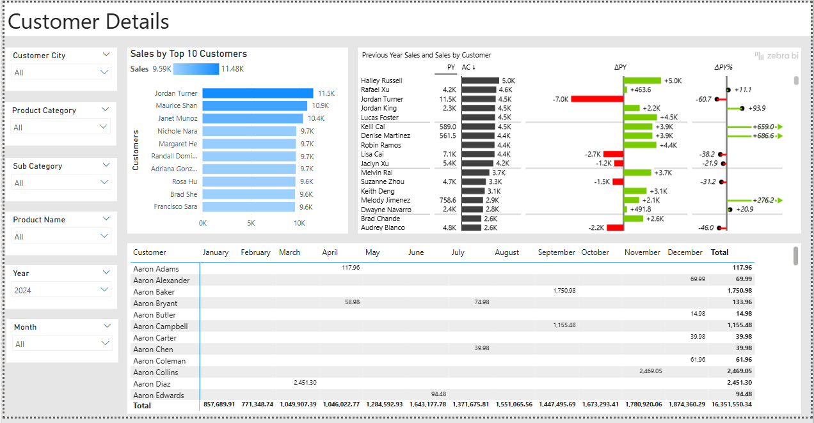
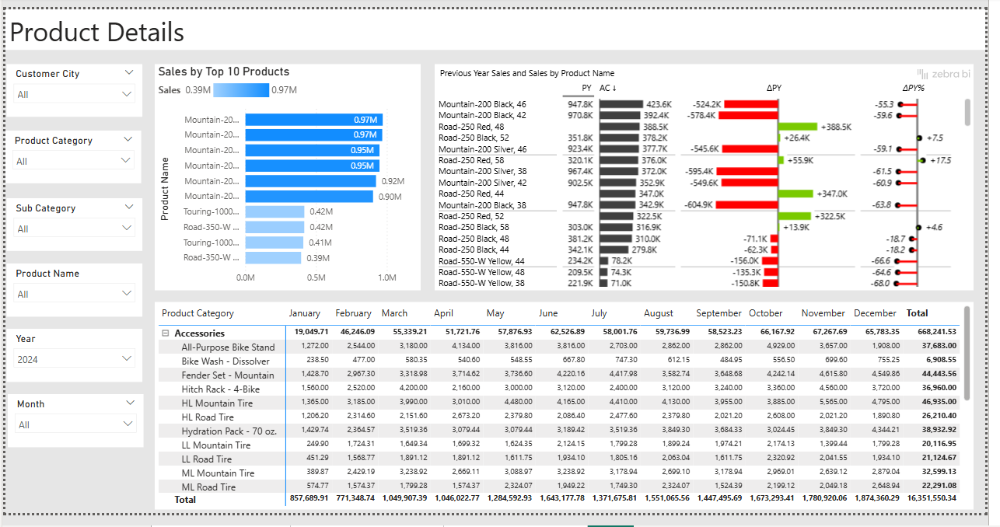

# Adventure Works Sales Report 2022 - Power BI Dashboard

##  Project Overview

This project showcases an interactive Power BI dashboard built using **Adventure Works Sales data** for the year **2023–2025**. The dashboard enables detailed sales analysis by **customer, product category, sub-category, city, month**, and **year**, helping stakeholders derive business insights such as:

- Top and bottom performing customers
- Sales trends over time
- Year-over-year (YoY) performance
- Sales performance against budget targets
- Product and customer segmentation

The goal of this dashboard is to demonstrate the power of **data storytelling** with interactive visuals, slicers, and DAX calculations to track **performance**, identify **opportunities**, and make **data-driven decisions**. Here you can see the detailed project overview:


## Business Requirements
The goal of this report is to help business stakeholders:

- Track sales performance across products, cities, and customers.
- Monitor how sales compare to targets (budget).
- Analyze growth and decline in sales versus the previous year (YoY).
- Identify top-performing customers and regions.
Detailed Requirements are mention in file 

## Enviorenment or Tools
SQL, Docker, MS SQL Server, Dbeaver, Excel Files, PBI, Github.
## Data Source & Processing

- The dataset was .bak file on a website downloaded from there and restored in MS SQL Server through docker and it includes many tables like:
  - Customer
  - Product
  - Geography
  - Calendar (Date)
- Data cleaning, transformation was done in dbeaver and files are placed in code/ folder.
- Modeling were done in **Power BI**.
- Relationships were established between fact and dimension tables using **Star Schema**.

## 📁 Files in this Repository

| File Name | Description |
|-----------|-------------|
| `Adventure Works Sales Report 2022.pbix` | Main Power BI dashboard file |
| `README.md` | Project description |
| `.png` | Images containing dashboard screenshots (referenced below) |
| `Code/` | Folder containing transformations performed for cleaning data to get it ready for reports |
| `data/` | Folder containing data files exported after transformations to upload in PBI |
| `Business Demand Overview.pdf` | Document including all business requirements to make report |
| `Model_PBI.png` | Image which shows PBI data model |
| `Model Architecture.png` | Image involves overall project architecture overview |
## 🧩 Dashboard Features

### 1. **Sales Overview Page**

This page provides a high-level summary of overall sales metrics, budget comparisons, and monthly trends.

- Total Sales
- Net Budget
- YoY Growth analysis
- Monthly sales trends with line and clustered column charts
- Sales by Top 10 Customers
- Sales by Top 10 Products
- Map showing slaes by customer city


### 2. **Customer Details Page**

This section highlights customer-level sales performance:

- Top 10 customers by sales
- Sales comparison with previous year (PY)
- Absolute and percentage YoY growth
- Visual indicators of performance using Zebra BI charts
  


### 2. **Product Details Page**

This section highlights product-level sales performance:

- Top 10 products by sales
- Sales comparison with previous year (PY)
- Visual indicators of performance using Zebra BI charts
  


## 🧠 Key DAX Measures

Here are some of the core DAX measures used in the dashboard:

### Sales
```DAX
Sales = sum(Fact_InternetSales[SalesAmount])
```
### Percentage to Target
```DAX
Performance = 
DIVIDE([Sales], [Net Budget], 0)
```
### Previous Year Sales
```DAX
Previous Year Sales = 
CALCULATE([Sales], SAMEPERIODLASTYEAR('Dim_Calendar'[Date]))
```
### Year Over Year Growth Percentage
```DAX
YoY Growth % = 
DIVIDE([Sales] - [Previous Year Sales], [Previous Year Sales], 0)
```
## Key Insights
- Identified top 10 customers contributing the most to revenue.
- Tracked performance vs. targets and found underperforming segments.
- Visualized YoY trends to highlight growth or decline in customer engagement.
## How to Use
- Clone the repository: git clone https://github.com/your-username/adventureworks-sales-report.git
- Open the Power BI file (Adventure Works Sales Report 2022.pbix) using Power BI Desktop.
- Refresh the data source if necessary.
- Use slicers for filters like Product Category, City, Month, or Year to explore deeper insights.
